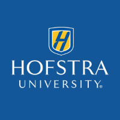

# Diagnosing and Improving Resource Retention in Serverless Platforms

**This repository contains the code and tools related to the 2021 7x24 challenge presentation by the Hofstra University team.**

The benchmarking code is based on the excellent [benchmarking tool](https://github.com/kevinslin/lambda-when-will-i-coldstart) by [Kevin Lin](https://github.com/kevinslin).

The "Just In Time Provision" code is based on the [Serverless WarmUp Plugin](https://github.com/juanjoDiaz/serverless-plugin-warmup) by [Juanjo Diaz](https://github.com/juanjoDiaz).

**Team**

- Matthew Elbing
  - Computer Science and Cybersecurity
- Mark Kornfeld
  - Computer Science (Concentration in Networking and Cybersecurity)
- Michael Raymond
  - Computer Science and Cybersecurity
- Jason Jackrel
  - Computer Engineering

**Advisor**

Dr. Jianchen Shan Ph.D, Assistant Professor

**Affiliation**

Hofstra University
